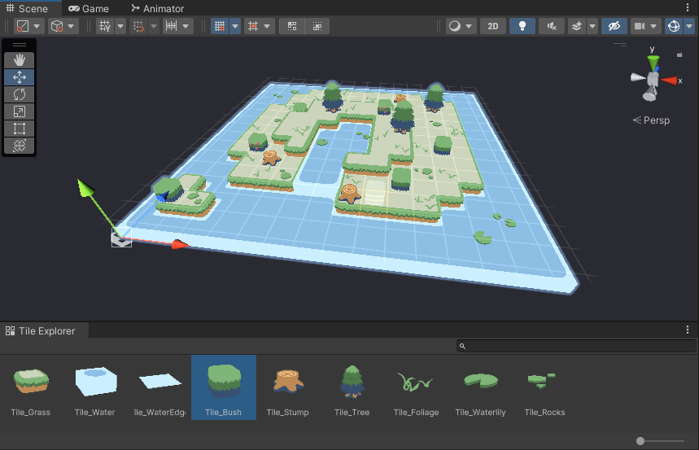
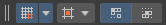

# Getting started

## Install instructions
Start a new Unity Project and navigate to the Package Manager (Window > Package Manager).  
Open the [+] dropdown and select "Add package from git URL ...". The URL is the adress of this repository.  
Please refer to the documentation for it's usage.  
Install the sample project for a usecase example.  

## Setting up your first map

Create an empty gameobject and select **[AddComponent >  Tilemap3D]**.  
You will be greeted with the interface above (the modules list will be empty).  
Start by deciding on the grid size (width height and depth of a single tile) and the map size.  
Map size can be changed later but keep in mind that map tile data culled in the process will be lost forever. 
Lastly you can find the module list. Start by clicking the little   at the bottom and choose a TilemapMesh module. Painted tiles should now be visible.  

## Setting up your tiles

The topic on how to set up tiles is discussed on the next sub page. If this is your first time using the tool you can use the included samples which already have pre set up tiles available.  
 
With our map set up our next step will be to add some tiles to our palette.  
In the Unity menu bar navigate to **[Window > TileExplorer]**. 
This will open up a small window that can be docked anywhere inside the editor environment.  

- The explorer will always show the palette of the current selected map so make sure to select the gameobject holding ours (if you created the map with the explorer open you need to deselect and reselect the map to refresh).

- To add new Tiles to the palette simply drag and drop tiles from your project browser into the palette (one tile at a time).

- Tiles inside the palette also have a right click menu that allows deleting or swapping them out.

Once we have a collection of tiles ready the current painting index can be selected by clicking the desired tile inside the grid.
!!! Info
    Don't have any tiles? Either try using the ones that are provided in the sample project or refer to the page "tile-setup" for how to make your own

## Navigating the scene view

If a valid map is selected the scene view inside Unity should display a new grid. This grid is used to determine on which layer our tiles are painted.  
The painting feature is based on dragging out boxes so let's start by clicking somewhere on the map and dragging out a selection. Once the right mouse button is released our tiles will be placed.  
The whole tool is navigated by a few key combos.  

## Input mapping
| Input               | Action                                             |
|---------------------|:---------------------------------------------------|
| Right click         | Place tile (hold for dragging out a box)           |
| Right click + Shift | Delete tile. (hold for dragging out a box)         |
| Left click + Shift  | Pick a tile                                        |
| W Key               | Move grid up one layer                             |
| S Key               | Move grid down one layer                           |
| A Key               | Rotate tile clockwise                              |
| D Key               | Rotate tile counter clockwise                      |
| A Key + Shift       | Move to the previous tile variation (if available) |
| D Key + Shift       | Move to the next tile variation (if available)     |

!!! Warning
    Sometimes Unity messes with the key focus. In that case simply refresh by tapping middle mouse or left click and try again.

## Toolbar

The tool also comes with it's own toolbar.  
If the toolbar does not show press the **space key** somewhere in the scene view and select **[Tilemap-Brush]** in the popup.  
The toolbar panel can be docked anywhere inside the interface. It consists of three elements:  

- **Grid:** This doubles as a toggle to show or hide the tilemap grid and a dropdown.
You can change the major axis (useful if working on a 2.5d map) or how the brush is previewed.
While the **Material** preview is more accurate **Shape** can be seen through the map.

- **Tile:** The second dropdown can be used to manualy set the brushes settings in case you are not able to use the earlier input mappings. Additionaly you can find an option for tile randomization. Just don't forget to turn it off again once you are done.

- **Flags:** Lastly we have a list of registered flags which are written into the painted tiles. The package only uses two of the eight available spaces for it's auto tiling. By using either of them you can force different tiles to behave as if they have the same source.

---

That's it for the basic introduction. Please refer to the other pages for a detailed explanation of the modules and tiles.  
If you encounter any tool breaking bugs that are not mentioned inside the documentation please open an issue on the github page.  