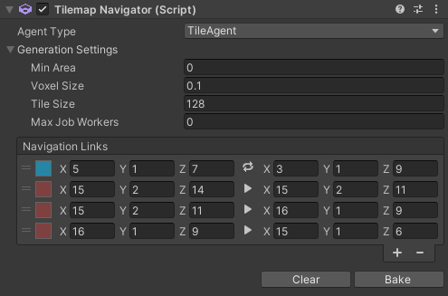

# Modules

## Overview

Modules are used to determine how the given map data is processed.  
They are component based and can therefore be directly added to child gameobjects of a Tilemap component.  
An easier way to add them is via the module list inside the inspector of said component.  
The module list also allows for quick baking of the modules but there are some options only visible when selecting the components directly.  

## Tilemap Mesh

Module for baking the mesh. It uses Unitys job system together with the tile list and data to generate the visual representation.  
The mesh module has two settings:  

- **Chunk Size:**
This option allows splitting large tilemaps into multiple game objects which can then each be culled individually. Using a value of 0 or below will cause the tilemap to not generate any sub chunks on the given axis. Values are in grid units. Hit bake and you can see the sub objects being generated as children.

- **Vertex Info:**
Opening this foldout will reveal a bunch of available vertex data types. The underlying algorithm will only copy ticked data from it's tile meshes. It is highly reccomended to only tick boxes you will need on your final mesh since each additional attribute will also increase the size the mesh will take inside the memory.

## Tilemap Collider

This module will use the available collision data set inside the tiles to generate an optimized collider.  
It will only generate manually when hitting the bake button on the component or inside the maps module list. 
It is highly reccomeded to rely on as many box colliders as possible since the underlying algorithm will sweep over them and combine them into multiple bigger boxes.  
Mesh colliders on the other hand will be copied one at a time since Unitys Mesh Collider type does not offer any option to offset them and combining the meshes would cause their bounding box to grow much larger.  
If tiles have different layer masks the resulting colliders will be placed on seperrate game objects. 
If the components gameobject is set to static all colliders will also be set to static.

## Tilemap Navigator

This module is used to bake a Unity NavMesh from the tilemap data. The component will use tiles with collision types of Box, MeshBounds, MeshConvex and MeshComplex only.  
Like with the collision the baking process has to be called manualy.  
The module has a few settings:  

- **Agent Type:** The NavMesh generation will refer to the coresponding agent settings from Unitys navigation window. Try adding your own or modify the default one.

- **Generation Settings:** Additionaly you can provide a number of generation related settings in the foldout. Refer to the page NavMeshBuildSettings inside of Unitys official documentation if you want to know what each setting does.

- **Navigation Links:** Since Unitys component based NavOffLinks did not work with the generated NavMesh this module instead provides it's own way to generate said links. Use the **+** button on the list to add a new link.  
Each link consinsts of the following options:
    - Area dropdown (the color rect) to select one of the set up areas of the navigation window. Traveling cost will be taken from the coresponding area.
    - Two tripplets of coordinates representing the start and end position of the link in grid space.
    - Toggle button between the coordinates signaling if the link can be traveled in both directions.

Navigation links are also visualized in the scene view where it is also possible to select their start and end point and move it around.  
The actual generated links are only available at runtime which enables the the component to clean them up when they are no longer needed.  

## Known "issues"

There is a list of things that can go wrong when using the modules in unintended ways. These are either hard to fix or would have an unecessary impact on performance:  

- When copy pasting a whole map temporary references are also copied. This means editing will also update the old one. To fix this simply delete and readd the modules after duplication

- You might encounter null pointer exception when deleting generated sub modules by hand. These have cached elements for consecutive rebuilding. Please do not clear them by hand and instead either use the clear button or delete the whole module

- When updating some components at runtime you might run into an error regarding the meshes. A lot of performed operations require a tick in the checkbox "Read/Write" in the mesh importer

- The collider component is unfit for consecutive runtime refreshes. Unitys colliders are components so it has to create and destroy quite a few of them. If you need a more dynamic solution either look into Unitys Job based physics or create your own logic (full tile collision could easily be implemented by checking directly against the Tilemap.Data array)

- There is no tile specific navigation or pathfinding in Unitys NavMesh. If you need a more tile based algorithm you can try implementing an A* approach