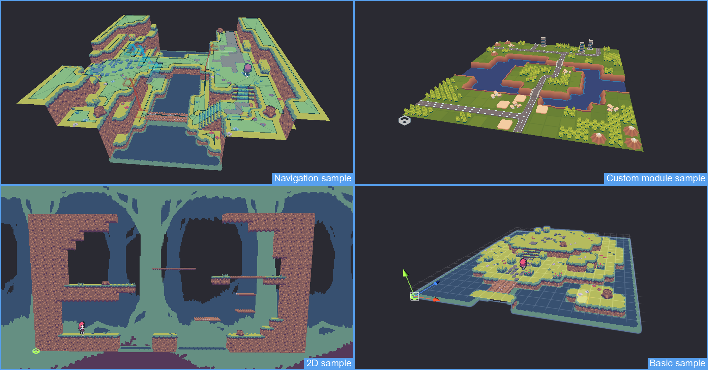

This package contains an editor editor extension for speeding up the development with mesh based tiles inside the Unity engine.  
It's features and modular extensibility make it widely usable over  all kind of projects both at editor and runtime.  

 

# Features
- Components for authoring tile based maps (processing via modular sub components)
- Mesh based tile setups via different included types (Single / Multi / Auto)
- Mesh module using Unitys Job System to efficiently combine Mesh Tiles into a large mesh (supports chunking)
- Collision module to create optimized box compound colliders (supports mesh colliders if needed)
- Navigation module for baking a Unity NavMesh for the map
- Interfaces to provide custom modules / tiletypes if required

 

# Requirements
Unity 2021.3+

 

# Install instructions
Start a new Unity Project and navigate to the Package Manager (Window > Package Manager).  
Open the [+] dropdown and select "Add package from git URL ...". The URL is the adress of this repository.  
Please refer to the documentation for it's usage. Install the sample project for a usecase example.

 

# Included samples

## PixelMapSample
- Shows basic usage of the included tools
- Includes a custom character controller for testing the different features
- Navigation scene shows how to use the navigator component to build a NavMesh
- 2D scene focues on setting up tiles on the XY axis
- Includes a shader to show an example for animated tiles (via uv offset)

## WorldMapSample
- Shows implementation of a custom tile type and module (Prefab based)
- Features an example of modifying the tilemap at runtime (select building and hit the delete key)
- Features a procedural runtime generation example (hit the R key to generate)

 

# FAQ
## Can this be used to create games of genre X?
| Genre     | Support |  Comments                                                             |
|-----------|:-------:|:----------------------------------------------------------------------|
| Topdown   | Yes     | Main focus of the tool                                                |
| Rougelike | Yes     | Procedural map generation not included                                |
| 2.5D      | "Yes"   |  Limited support on modules                                           |
| 2D        | No      | Use Unity Tilemap instead                                             |
| Blockgame | No      | Data is stored in a fixed length array (not intended for huge worlds) |

## Why only Unity 2021+
Unity 2020 does not support the new Mesh API and 2021 does not support custom toolbars.

## Where can I find the documentation?
There is a subfolder called ~Documentation. In there you can find a selection of articles about the general usage.

## Is this URP/HDRP compatible?
Yes.

## Is the tilemap runtime compatible?
Yes and no. All the tile logic and meshing methods should be usable at runtime. 
The interface is Unity Editor only though so you will have to write your own runtime interface.

## I have an issue?
Since this is a hobby project I do not offer live support. If you encountered a bug file an issue on the repository page.  
If it's about a feature request or something covered in the FAQ I might not feel inclined to answer though.

## Why is it not on the Asset Store?
a) I don't see a lot of value from selling it. The maintenance cost / revenue ballance does not seem worth it  
b) I want to give users the ability to easily accsess and learn from the code  

## Can I include this as part of a commercial offering?
Please do not sell the source or include it inside a product sold via the Asset Store.  
Everything else is totally fine with me and covered by the license.

## Where do I get the tile meshes from?
Sources of compatible 3D meshes are not common so you are for most part on your own.  
You can use a modeling tool like Blender to create your own tiles. There is a section in the documentation that goes over this topic.

## Can I contribute?
The package itself is feature complete and I would like to keep the amount of contributors to a minimum so in most cases the answer is no.  
To avoid bloating the package itself new features are intended to be added as modules (check the documentation and the WorldMapSample to get a genreal idea).  
If you require some larger scale modifications to the source please create a fork instead.

## I created something using the package? (custom module or game)
Feel free to drop me a message (mail is at the bottom of my portfolio page) and I will give you a shoutout in the documentation.
